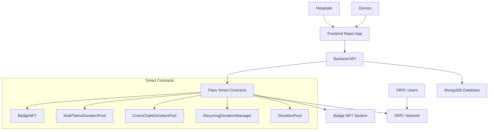

# 🚑 FlareHelp - Cross-Chain Emergency Healthcare Funding Platform

<div align="center">


**Revolutionizing emergency healthcare funding through blockchain technology and equal distribution**

[](https://opensource.org/licenses/MIT)
[](https://soliditylang.org/)
[](https://reactjs.org/)
[](https://nodejs.org/)

</div>

## 🌟 Overview

FlareHelp is a revolutionary cross-chain donation platform that enables rapid emergency healthcare funding through blockchain technology. Built on Flare Network with XRPL integration, it uses an innovative **equal distribution system** where every donation helps multiple people simultaneously.

### 🎯 Key Innovation: Equal Distribution System

Instead of funding one emergency at a time, your donations are pooled and distributed equally among ALL active emergency requests. This means:

- **$5 donation** → **10 active requests** → **$0.50 per request** → **You help 10 people!**
- **Maximum Impact**: One donation helps multiple people
- **Transparent**: See exactly how your money flows
- **Efficient**: No waiting for individual requests to be fully funded

## 🏗️ Architecture



## 🚀 Features

### 💰 Multi-Currency Donations
- **Native FLR**: Direct Flare Network donations
- **USDC/USDT**: ERC-20 token support
- **XRPL**: Cross-chain XRP donations via Flare's FDC
- **Credit Card**: Traditional payment integration

### 🔄 Recurring Donations
- **Monthly Subscriptions**: Automated recurring payments
- **Flexible Amounts**: Set any monthly donation amount
- **Cross-Chain Support**: XRPL-based recurring donations
- **Easy Management**: Update or cancel anytime

### 🏆 Impact Tracking & Recognition
- **Real-time Impact**: See lives helped in real-time
- **Donation History**: Complete transaction history
- **Badge System**: NFT achievements for milestones
- **Equal Distribution Calculator**: Visual breakdown of how your money helps

### 🏥 Hospital Integration
- **Emergency Request Creation**: Hospitals can create urgent funding requests
- **Document Verification**: Secure document upload and verification
- **Instant Funding**: Automatic funding when pool has sufficient funds
- **Cross-Chain Payouts**: Receive funds via XRPL or Flare

### 🌉 Cross-Chain Interoperability
- **Flare-XRPL Bridge**: Seamless cross-chain donations
- **FDC Integration**: Uses Flare's Data Connector for XRPL verification
- **Multi-Network Support**: Works across different blockchain networks

## 📁 Project Structure

```
flare-hardhat-starter-abdul/
├── contracts/FlareHelp/           # Smart Contracts
│   ├── DonationPool.sol          # Main donation contract
│   ├── RecurringDonationManager.sol # Subscription system
│   ├── CrossChainDonationPool.sol   # XRPL integration
│   ├── MultiTokenDonationPool.sol   # Multi-currency support
│   └── BadgeNft.sol              # Achievement system
├── frontend/                      # React Frontend
│   ├── src/
│   │   ├── components/ui/         # UI Components
│   │   ├── pages/                 # Page Components
│   │   ├── services/              # Blockchain integration
│   │   └── styles/                # Neo-brutalist styling
├── backend/                       # Node.js Backend
│   ├── models/                    # MongoDB models
│   ├── routes/                    # API routes
│   └── middleware/                # Authentication & validation
└── scripts/                       # Deployment & utility scripts
```

## 🛠️ Technology Stack

### Smart Contracts
- **Solidity** ^0.8.19
- **OpenZeppelin** Contracts
- **Flare Periphery** Contracts
- **Hardhat** Development Framework

### Frontend
- **React** 18.2.0
- **TypeScript** 4.9.5
- **Tailwind CSS** 3.3.3
- **Framer Motion** 10.16.4
- **Ethers.js** 6.7.1

### Backend
- **Node.js** 18+
- **Express.js** 4.18.2
- **MongoDB** 7.5.0
- **Socket.io** 4.7.2
- **JWT** Authentication

### Blockchain
- **Flare Network** (Coston2 Testnet)
- **XRPL** Integration
- **Ethers.js** for Web3 interactions

## 🚀 Quick Start

### Prerequisites
- Node.js 18+
- MongoDB
- MetaMask or compatible wallet
- Git

### 1. Clone the Repository
```bash
git clone https://github.com/your-username/flarehelp.git
cd flarehelp
```

### 2. Install Dependencies
```bash
# Install root dependencies
npm install

# Install frontend dependencies
cd frontend
npm install

# Install backend dependencies
cd ../backend
npm install

# Return to root
cd ..
```

### 3. Environment Setup
```bash
# Copy environment files
cp backend/.env.example backend/.env
cp frontend/.env.example frontend/.env

# Edit the environment files with your configuration
```

### 4. Database Setup
```bash
# Start MongoDB (if not running)
mongod --dbpath /tmp/mongodb

# Setup database (in another terminal)
cd backend
node setup.js
```

### 5. Deploy Smart Contracts
```bash
# Compile contracts
npx hardhat compile

# Deploy to Coston2 testnet
npx hardhat run scripts/FlareHelp/deploy.js --network coston2
```

### 6. Start Development Servers
```bash
# Terminal 1: Backend
cd backend
npm run dev

# Terminal 2: Frontend
cd frontend
npm start
```

## 🔧 Configuration

### Environment Variables

#### Backend (.env)
```env
PORT=5001
MONGODB_URI=mongodb://localhost:27017/flarehelp
JWT_SECRET=your-jwt-secret
PRIVATE_KEY=your-private-key
FLARE_RPC_URL=https://coston2-api.flare.network/ext/bc/C/rpc
```

#### Frontend (.env)
```env
REACT_APP_API_BASE_URL=http://localhost:5001/api
REACT_APP_FLARE_RPC_URL=https://coston2-api.flare.network/ext/bc/C/rpc
REACT_APP_CONTRACT_ADDRESSES={"donationPool":"0x...","badgeNft":"0x..."}
```

## 📊 Smart Contracts

### DonationPool.sol
Main contract for donation management and impact tracking.

```solidity
// Key functions
function donate() external payable
function createRequest(string invoiceId, uint256 amountWei, string hospitalXrpl)
function getDonorImpact(address donor) external view returns (uint256, uint256, uint256)
function calculateEqualDistribution(uint256 donationAmount) external view
```

### RecurringDonationManager.sol
Manages monthly subscription donations.

```solidity
// Key functions
function createSubscription(uint256 amountWei, uint256 intervalDays, bool isXrpl, string xrplAddress)
function processDonorPayment(address donor)
function batchProcessPayments(address[] donors)
```

### CrossChainDonationPool.sol
Handles XRPL cross-chain donations.

```solidity
// Key functions
function processXrplDonation(bytes32 xrplTxHash, uint256 amount, address donor)
function createRequest(string invoiceId, uint256 amountWei, string hospitalXrpl)
```

## 🎨 Design System

FlareHelp uses a **neo-brutalist design system** with:

- **High Contrast Colors**: Bold, accessible color palette
- **Geometric Shapes**: Clean, industrial design elements
- **Typography**: Inter for UI, Anton for display
- **Animations**: Smooth, purposeful micro-interactions
- **Accessibility**: WCAG AA compliant

### Color Palette
```css
--bg: #F6F7F8        /* Light concrete background */
--panel: #E6E8EA     /* Card panels */
--ink: #0B0D0F       /* Near black text */
--accent: #FF4B3E     /* Emergency red */
--accent-2: #00B37E   /* Success green */
--accent-3: #1E90FF   /* Info blue */
```

## 📈 Impact Metrics

The platform tracks several key metrics:

- **Total Lives Helped**: Cumulative people helped across all donations
- **Equal Distribution**: How donations are split among active requests
- **Donor Impact**: Individual donor contribution tracking
- **Request Success Rate**: Percentage of fully funded requests
- **Cross-Chain Volume**: XRPL vs Flare donation volumes

## 🔒 Security Features

- **Role-based Access Control**: Different permissions for donors, hospitals, admins
- **Input Validation**: Comprehensive validation on all inputs
- **Rate Limiting**: Protection against spam and abuse
- **Secure Document Upload**: Encrypted document storage
- **Smart Contract Audits**: Regular security audits (planned)

## 🧪 Testing

```bash
# Run smart contract tests
npx hardhat test

# Run frontend tests
cd frontend
npm test

# Run backend tests
cd backend
npm test
```

## 🚀 Deployment

### Smart Contracts
```bash
# Deploy to Coston2 testnet
npx hardhat run scripts/FlareHelp/deploy.js --network coston2

# Verify contracts
npx hardhat verify --network coston2 <CONTRACT_ADDRESS>
```

### Frontend
```bash
cd frontend
npm run build
# Deploy build/ folder to your hosting service
```

### Backend
```bash
cd backend
npm start
# Deploy to your cloud provider
```

## 🤝 Contributing

We welcome contributions! Please see our [Contributing Guidelines](CONTRIBUTING.md) for details.

### Development Workflow
1. Fork the repository
2. Create a feature branch
3. Make your changes
4. Add tests
5. Submit a pull request

## 📄 License

This project is licensed under the MIT License - see the [LICENSE](LICENSE) file for details.

## 🙏 Acknowledgments

- **Flare Network** for the cross-chain infrastructure
- **XRPL Foundation** for interoperability support
- **OpenZeppelin** for secure smart contract libraries
- **React Community** for the amazing frontend ecosystem

## 📞 Support

- **Documentation**: [Wiki](https://github.com/your-username/flarehelp/wiki)
- **Issues**: [GitHub Issues](https://github.com/your-username/flarehelp/issues)
- **Discord**: [FlareHelp Community](https://discord.gg/flarehelp)
- **Email**: support@flarehelp.org

## 🌟 Roadmap

### Phase 1: Core Platform ✅
- [x] Basic donation system
- [x] Cross-chain integration
- [x] Impact tracking
- [x] Neo-brutalist UI

### Phase 2: Advanced Features 🚧
- [ ] Mobile app
- [ ] Advanced analytics
- [ ] Multi-language support
- [ ] API for third-party integrations

### Phase 3: Global Expansion 📋
- [ ] Additional blockchain networks
- [ ] Fiat currency support
- [ ] Advanced hospital verification
- [ ] AI-powered impact prediction

---

<div align="center">

**Built with ❤️ for emergency healthcare funding**

[](https://flare.network/)
[](https://xrpl.org/)

</div>